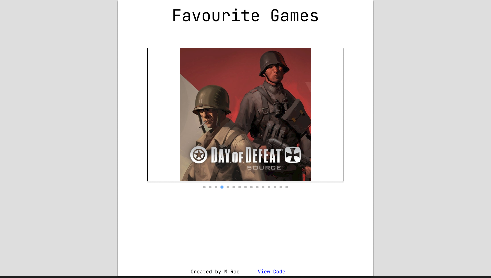

# image-carousel

[Link to live page](https://mattyjrae123.github.io/image-carousel/)

This project is part of 'The Odin Project' javascript course. It's a simple image carousel front end web app. 

I'll be using HTML, CSS and JS but also utilising node and webpack for development tools.

## Plan
Create an image carousel with clickable navigation circles below the "picture frame". Should also be navigatable by using the left/right arrow keys.

## Model
- Store carousel "images" in private array
- Public functions to get current image, set current image, navigate to next/previous image

## View
- Init function to generate "navigation circles" and assign data keys that correspond to array indeces for the images
- Function to update current image and set current "navigation circle" to active

## Controller
- Coordinate flow between Model and View
- Start Model and View init functions
- Set event listeners on relevent View objects

#### Rough design (ignore colours)

